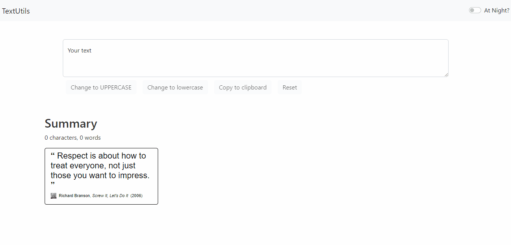
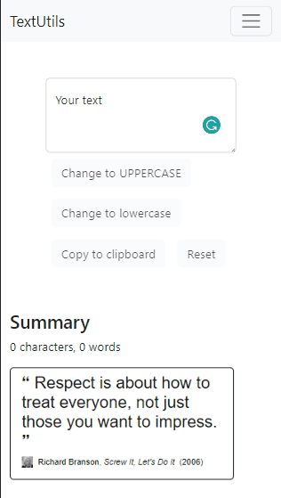

<h1 align="center">Welcome to barebones-textutils 👋</h1>
<p>

  <a href="https://unlicense.org/" target="_blank">
    
  </a>
</p>

> Barebones-TextUtils is react app which has bare-minimum-features text utility.




### ✨ [Demo](https://parthvyas7.github.io/barebones-textutils/)

## Install

```sh
npm install
```

## Usage

```sh
npm start
```

## Author

👤 **Parth Vyas**

- Website: [@parthvyas7](https://parthvyas7.github.io/parthvyas7/)
- Github: [@parthvyas7](https://github.com/parthvyas7)
- LinkedIn: [@parthvyas7](https://linkedin.com/in/parthvyas7)

## 📝 License

This project is [UNLICENSE](https://unlicense.org/) licensed.

---

_This README was generated with ❤️ by [readme-md-generator](https://github.com/kefranabg/readme-md-generator)_
